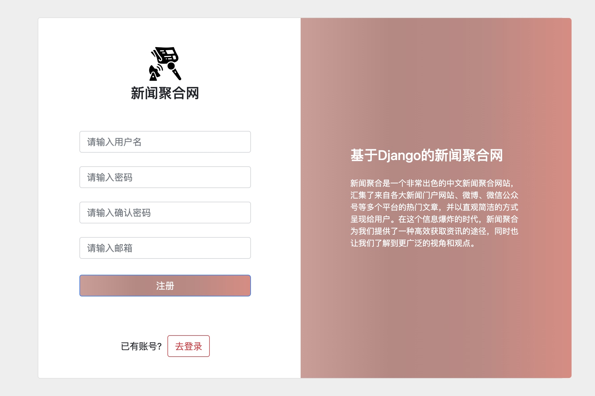
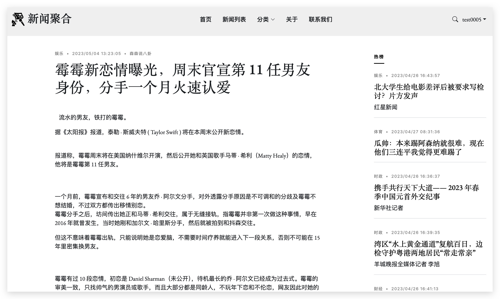

# 基于Django的新闻聚合系统
基于Python+Django的新闻聚合系统
数据来源采用BeautifulSoup爬取, 数据库使用Mysql5.7, 结合Django框架对网站进行开发。
#### 源码获取请见最下方联系方式

## 页面效果展示

### 登录

### 注册

### 首页

### 新闻列表

### 新闻详情

### 评论

### 个人中心

### 联系我们

### 关于我们

### 源码获取
##### + xushien456 务必备注来意 或点击下方链接
https://www.yuque.com/wechatname-3aout/zr1vau/lvduggftsnqnczy0?singleDoc#
